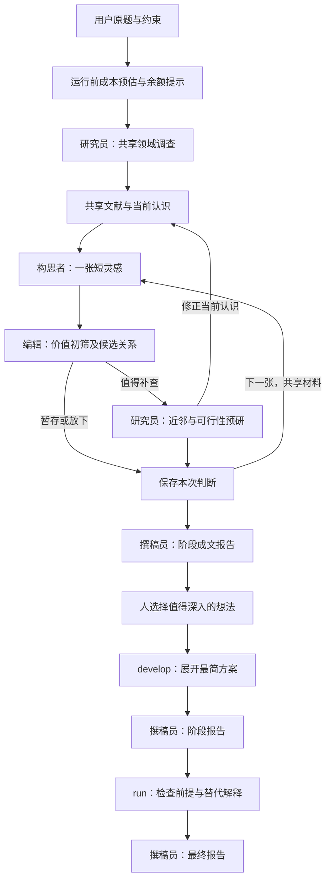

# ARC 架构与关键角色

ARC 的目标是帮助人发现值得研究的想法，并看清已有工作、可行性和主要风险。它围绕一个主题反复抽取短灵感，共享文献与最新认识；只有值得继续投入的想法才进入较深入的预研。训练实验和论文仍由人负责。

图中的框是任务职责，不是各自占用一台服务器，也不必使用不同模型。当前默认都调用 `deepseek-flash`。是否进入后续阶段由人决定；本轮用户明确授权 CodeX 代为选题和最终审阅，这不是生产服务的固定环节。

## 四个关键角色

| 角色 | 要解决的问题 | 主要交付 |
| --- | --- | --- |
| 研究员 `scout` | 现有路线解决了什么，证据有何限制；这张想法的关键前提与最近工作是否站得住 | 共享调查 `SURVEY`、候选预研 `CHECK`；被选中后还承担 `DEVELOP` 与 `PRESSURE` |
| 构思者 `ideator` | 从材料中发现一个非显然、值得继续追问的认识，或一个有机制依据的简洁方法 | 一张短灵感 `SKETCH`，说明问题、核心想法、意义及最大未知 |
| 编辑 `editor` | 这张是否值得追加调查；与刚才的候选是独立问题、替代路线，还是评估支撑 | 价值初筛 `TRIAGE`，以及一至两个决定去留的核查问题 |
| 撰稿员 `writer` | 怎样让人迅速理解当前结论、技术思路与限制 | 阶段末一次 `POLISH`，整理总览和候选正文；不检索、不改变研究判断 |

调查和预研不是两名重复审稿人，而是研究员在不同投入阶段的任务。`develop --idea` 展开最简进入路径、文献差异、资源与风险；`run --idea` 继续检查影响研究价值的前提和替代解释。这里的 run 并不运行训练实验。

`discuss` 表示值得讨论，`lead` 是尚有关键问题的线索，`drop` 是本轮放下。“SSR”只是人挑出的高价值候选称呼，并非系统给自己颁发的科研认证，不设固定名额或淘汰率。

## 四类共享对象

领域简报 `FieldBrief` 保存路线关系、切入点和来源笔记。短灵感 `IdeaSeed` 保存初始想法。初筛结果 `TriageResult` 决定是否继续投入。预研卡 `IdeaNote` 保存查后的判断、近邻、可行性和未知。

每次补查可以更新共享简报，并记录“当前有效认识”：还剩下的核心想法、已撤回的前提、决定性未知。下一张卡和档案召回读取当前认识，而非继续使用旧初稿。原稿和旧简报保留历史。develop 新得到的笔记与修正也会进入后续 run，避免重复调查或恢复旧印象。

## 后台如何支撑

- **工作流与运行器**：工作流决定当前任务和下一步；运行器负责真实模型/工具请求、结构化返回、已完成任务复用和恢复。一个研究任务可能包含多次模型请求。
- **文献与工具**：通过 MCP（模型上下文协议，一种连接外部工具的接口）调用论文、网页检索与阅读服务；已读取内容保存到本地，长文按需分页读取。当前单次缓存读取上限为64000字符。
- **状态与费用**：SQLite 数据库保存主题、候选、任务和账本，文件保存文献与原始响应。来源可定位、结构合法，不等于科学解释正确；失败和未知费用不抹除。
- **预算提示**：运行前给经验或启发式预计范围，并尽力查询供应商余额。余额较低时警告，查询失败仍可运行。预计费用、钱包余额、账本授权额度和请求预留分别记录，不能混为一谈。
- **报告**：研究过程中提供技术稿；阶段末只调用一次撰稿员。面向用户的 `REPORT.md` 与候选正文使用成文版本，`TECHNICAL_REPORT.md` 和候选技术稿保留原始细节。报告不替换数据库中的科学判断。

## 旧完整卡路径

旧的新颖性检查、筛选、质疑者、协调者和科学审查角色仍服务于历史任务、显式完整卡入口或旧评价命令。它们不再是默认 discover 的必经流水线。当前主入口是 `discovery_workflow.py`，公共调度在 `workflows.py`，模型请求在 `runtime.py`，费用提示在 `preflight.py`，最终成文在 `polishing.py` 与 `reports.py`。
