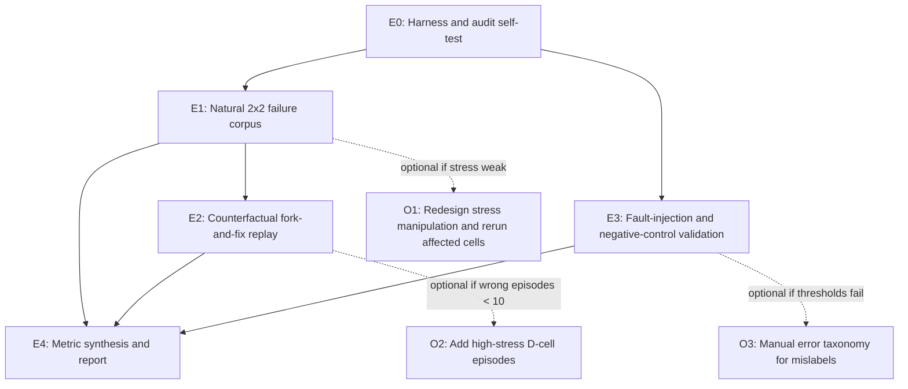

```markdown
# EXPERIMENT_PLAN.md

## 1. Objective

Validate whether construction loss and retrieval loss in an explicit-memory long-horizon LLM agent can be **separately attributed** using:

- deterministic write-time audit (`T0`),
- deterministic retrieval-time audit (`T1`),
- counterfactual fork-and-fix replay,
- injection of known construction/retrieval faults,
- a mandatory no-fault negative control.

The pre-registered success threshold is:

- Construction fault precision ≥ 0.70
- Construction fault recall ≥ 0.70
- Retrieval fault precision ≥ 0.70
- Retrieval fault recall ≥ 0.70
- Negative-control false-label rate ≤ 0.10

## 2. Shared audit definitions

- `T0_pass`: a written memory record contains all required source facts verbatim / as exact structured fields.
- `T0_fail`: a required fact is missing, wrong, extra, or no record was written for that evidence.
- `T1_retrieval_pass`: among records that passed `T0`, the record containing the terminal ground-truth fact is in the top-3 retrieved records and selected by the agent.
- `T1_retrieval_fail`: the correct `T0`-passing record is not retrieved/selected.

No LLM judgment is used in either audit.

## 3. Task graph



## 4. Must-run experiments

### E0: Harness and audit self-test

- **Objective:** Verify the event generator, memory schema, write/query tools, `T0`/`T1` auditors, and replay logic before collecting experimental data.
- **Input data:** Small hand-curated fixtures:
  - 5 known-correct episodes,
  - 5 episodes with deliberately injected construction faults,
  - 5 episodes with deliberately injected retrieval faults,
  - 2 no-fault episodes.
- **Baseline:** Oracle labels are known for every fixture; no statistical baseline is needed.
- **Metrics:**
  - Audit agreement with oracle labels on fixtures,
  - Replay harness does not mutate original logs,
  - All `T0`/`T1` checks execute deterministically.
- **Expected failure mode:** Harness bug or audit mutation found in > 2 fixture episodes; if so, stop and fix before running any real episodes.
- **Wall-clock estimate:** ~0.5 day. No GPU; CPU + API only.

---

### E1: Natural 2×2 failure corpus

- **Objective:** Generate naturally occurring terminal failures under the four factorial stress conditions and log exhaustive construction/retrieval audit evidence for later replay.
- **Input data:**
  - 60 generated episodic tasks, with 30 events per episode and 4 atomic facts per event.
  - Terminal question requires combining evidence from 2–4 events.
  - 15 episodes per factorial cell:
    - A: low construction stress / low retrieval stress
    - B: high construction stress / low retrieval stress
    - C: low construction stress / high retrieval stress
    - D: high construction stress / high retrieval stress
  - Fixed backbone model and sampling settings throughout.
- **Baseline:** Condition A (low/low) supplies the baseline terminal accuracy and baseline `T0`/`T1` failure rates.
- **Metrics:**
  - Per condition:
    - `correct`, `abstained`, `wrong` terminal counts,
    - `T0_fail` rate,
    - `T1_fail` rate among `T0`-passing records,
    - number of wrong episodes available for replay.
- **Expected failure mode:**
  - High construction stress does not raise `T0_fail` by ≥ 5 percentage points after the first 20 episodes; stop and redesign the construction-stress implementation.
  - High retrieval stress does not raise `T1_fail` by ≥ 5 percentage points; stop and redesign retrieval stress.
  - API/model instability: > 20% of episodes fail due to timeout or malformed tool calls.
  - Mechanical parse errors from the high-construction compression are logged separately and excluded from causal attribution counts.
- **Wall-clock estimate:** ~0.75 day. No GPU; API waiting time is small.

---

### E2: Counterfactual fork-and-fix replay

- **Objective:** For every naturally **wrong** episode, determine whether an oracle construction fix or an oracle retrieval fix changes the terminal answer from wrong to correct.
- **Input data:**
  - Natural-corpus logs from E1.
  - Only originally `wrong` episodes are replayed here; `abstained` episodes are reported separately and are not rescue candidates.
- **Baseline:** Original terminal answer before any replay.
- **Metrics:**
  - `construction_fix_rescue_count`
  - `retrieval_fix_rescue_count`
  - Construction-only rescue differential:
    - construction-fix rescues minus retrieval-fix rescues among episodes classified as construction-only.
  - Retrieval-only rescue differential:
    - retrieval-fix rescues minus construction-fix rescues among episodes classified as retrieval-only.
  - Wrong-to-correct, wrong-to-abstained, and wrong-to-wrong outcomes after each fix.
- **Expected failure mode:**
  - Construction-fix replay cannot be implemented without also changing retrieval dynamics, or retrieval-fix replay cannot be implemented without changing construction; stop and use the fallback path.
  - Fewer than 10 naturally wrong episodes make natural rescue differentials unreliable; switch the causal evidence claim to fault-injection validation.
- **Wall-clock estimate:** ~0.5 day expected. No GPU. The number of replays depends on E1 wrong rate; expected ≤ 120 replay runs, each with ≤ 10 LLM calls.

---

### E3: Fault-injection and negative-control validation

- **Objective:** Validate the attribution protocol against known ground-truth faults.
- **Input data:** 60 additional oracle-correct episode transcripts using the same stress protocol, allocated as:

| Fault type | A | B | C | D | Total |
|---|---:|---:|---:|---:|---:|
| Construction fault | 6 | 6 | 6 | 7 | 25 |
| Retrieval fault | 6 | 6 | 7 | 6 | 25 |
| No fault | 3 | 3 | 2 | 2 | 10 |
| **Total** | **15** | **15** | **15** | **15** | **60** |

- Injection rules:
  - **Construction fault:** modify one oracle-correct written record before `T0` audit so that it fails `T0`; no additional retrieval manipulation is applied.
  - **Retrieval fault:** leave all memory records correct; after the agent issues its terminal query, replace the returned top-k list with a list that excludes the correct record.
  - **No-fault negative control:** memory records remain correct and retrieval is not manipulated.
- All gold-cause labels must be written to `gold_cause.jsonl` **before** running E3.
- **Baseline:** Oracle-correct no-fault episodes should produce no construction label and no retrieval label.
- **Metrics:**
  - Construction fault precision and recall,
  - Retrieval fault precision and recall,
  - Negative-control false-label rate,
  - Full confusion matrix among gold causes: construction, retrieval, none.
- **Expected failure mode:**
  - Precision or recall below 0.70 on fault injection,
  - Negative-control false-label rate above 0.10,
  - Early stop check: if either construction or retrieval recall is below 0.50 after the first 30 injected episodes, debug the attribution logic before continuing.
- **Wall-clock estimate:** ~0.75 day. No GPU; API waiting time is small.

---

### E4: Metric synthesis and final report

- **Objective:** Compute all primary metrics, run pre-registered manipulation checks, and state whether the attribution protocol is validated.
- **Input data:**
  - E1 natural-run logs,
  - E2 replay results,
  - E3 fault-injection/negative-control logs,
  - `gold_cause.jsonl`.
- **Baseline:** Pre-registered thresholds and the fallback rules in the proposal.
- **Metrics:**
  - Final table with construction/retrieval fault precision/recall and negative-control false-label rate,
  - Construction-fix rescue count,
  - Retrieval-fix rescue count,
  - Rescue differentials for construction-only and retrieval-only classifications,
  - Stress manipulation checks:
    - `T0_fail` rate: low vs high construction stress,
    - `T1_fail` rate: low vs high retrieval stress.
- **Expected failure mode:**
  - If any validation threshold fails, do not report causal attribution as valid; publish the fallback correlational audit result.
  - If stress manipulation is weak, report manipulation-check failure and do not claim stress decomposition.
  - If replay contamination cannot be ruled out, use the fallback deliverable.
- **Wall-clock estimate:** ~0.5 day. No GPU.

---

## 5. Optional / conditional experiments

### O1: Redesign weak stress manipulation

- Run only if the E1 manipulation check shows high construction stress raises `T0_fail` by < 5 pp or high retrieval stress raises `T1_fail` by < 5 pp.
- Redesign the construction-stress or retrieval-stress implementation and rerun only the affected cells.
- This is a fallback pathway, not required for the primary protocol-validation claim.

### O2: Add high-stress D-cell episodes for sparse natural failures

- Run only if natural wrong episodes are fewer than 10 and the schedule has remaining capacity.
- Add up to 20 additional condition-D high/high episodes and re-run replay over the enlarged corpus.

### O3: Manual mislabel taxonomy after validation failure

- Run only if E3 fails any precision/recall/negative-control threshold.
- Manually inspect false-positive and false-negative attribution cases to determine whether the failure is caused by:
  - ambiguous audit predicates,
  - replay contamination,
  - confusing natural construction stress with retrieval stress.
- Feed results into the fallback report rather than as a causal validation.

---

## 6. Compute and wall-clock summary

| Experiment | Must-run? | Compute estimate |
|---|---|---|
| E0 | Must-run | ~0.5 day, CPU/API |
| E1 | Must-run | ~0.75 day, CPU/API |
| E2 | Must-run | ~0.5 day, CPU/API |
| E3 | Must-run | ~0.75 day, CPU/API |
| E4 | Must-run | ~0.5 day, CPU/API |
| O1/O2/O3 | Optional | 0–1 day total, CPU/API |

No experiment is compute-heavy. No single experiment exceeds 24 hours on one GPU because no GPU is required. Total expected API time is under 1 hour; the remaining schedule is for implementation, debugging, and analysis.

---

## 7. Artifacts

The final output will include:

- `EXPERIMENT_PLAN.md` — this document.
- `data/episodes_natural.jsonl`
- `data/episodes_injection.jsonl`
- `data/logs/` raw episode and tool-call logs
- `data/gold_cause.jsonl`
- `results/metrics.json`
- `FINAL_REPORT.md` with the validation table and fallback statement if thresholds are not met.
```

End of `EXPERIMENT_PLAN.md`.
